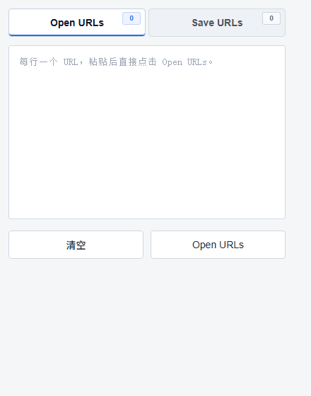

# Open-Save-Multiple-URLs

Open-Save-Multiple-URLs 是一个用于批量打开和保存标签页 URL 的 Chrome 扩展。

界面简洁，开箱即用，无需构建。

## 功能特点

- 一次粘贴多个 URL 并一键打开
- 默认自动去重
- 默认保留输入内容
- 跟随系统明暗主题自动切换界面
- 自动读取当前窗口全部标签页 URL
- 支持复制当前窗口全部 URL
- 支持导出 URL 为 `.txt` 文本文件

## 适用场景

- 临时收集一批页面链接，后续统一整理
- 一次打开多条 URL，提高重复操作效率
- 保存当前窗口标签页，方便复制、留档或导出

## 安装方式

1. 下载或克隆本项目
2. 打开浏览器 `chrome://extensions/`
3. 打开「开发者模式」
4. 点击「加载已解压的扩展程序」
5. 选择项目目录 `Open-Save-Multiple-URLs`

## 界面截图

## 界面说明

- `Open URLs`：粘贴一批 URL 后直接打开
- `Save URLs`：自动读取当前窗口标签页 URL，并支持复制或导出
- 自动主题联动：系统为暗色主题时扩展界面自动切换为暗色，系统为浅色主题时界面保持浅色
